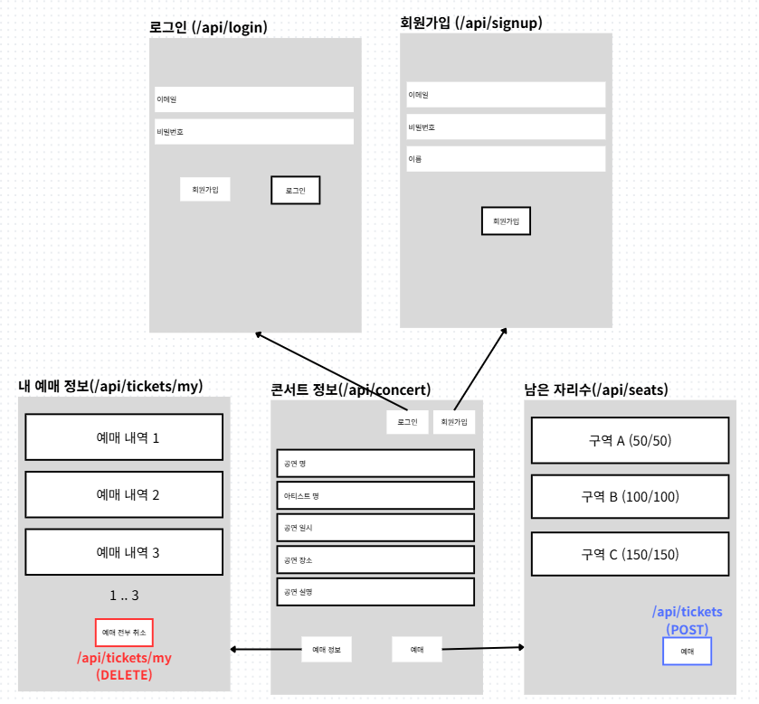
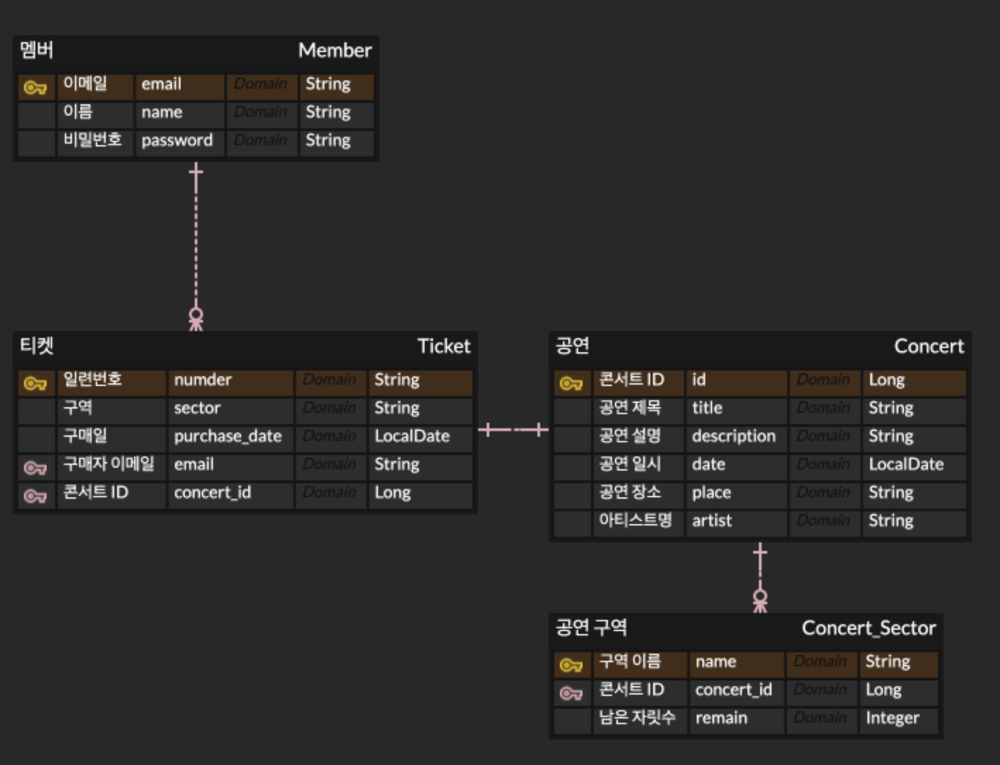
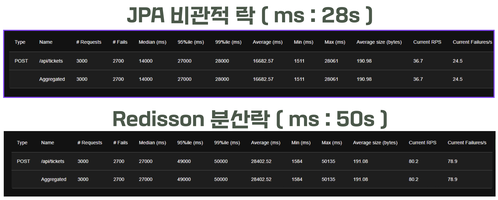
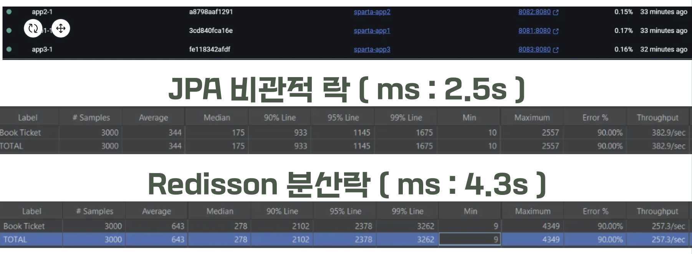

## 📚 프로젝트 소개

- 동시성 제어, 캐싱, 락 방식에 따른 성능측정을 진행하는 콘서트 예매 팀프로젝트입니다.

<br>

## 🚀 프로젝트 목표

- 기본적인 동시성 제어
- 비관적 락과 분산 락 적용 및 성능 측정

<br>

## 🧑‍💻 역할분담

| 이름  | 역할 | 담당 업무                                                                                    |
|-----|----|------------------------------------------------------------------------------------------|
| 장군호 | 팀장 | - 발표 <br>- 공연 정보 조회 (레디스 캐싱 기능 구현)<br>- ERD, 와이어프레임 작성                                   |
| 김도연 | 팀원 | - 잔여 좌석 조회 (Redis Lock을 이용한 남은 좌석 동시성 제어 포함) <br>- Lettuce -> Redisson 리팩토링, 티켓 구매/취소 적용 |
| 권용준 | 팀원 | - 회원 관리 관련 API 개발 (Security 적용)<br>- README 초안 작성                                        |
| 이의현 | 팀원 | - 티켓 crud (Lettuce spin Lock 적용)<br>- README 작성                                          |
| 한재현 | 팀원 | - 동시성 테스트 설계 및 진행<br>- 프로젝트 점검(sql, erd, 패키지 구조)                                         |

<br>

## 🛠 기술 스택

- Java 17
- Spring Boot 3.5.3
- Gradle 8.14.2
- MySQL 8
- Redis 8.0
- Redisson 3.27
- QueryDsl
- Spring Security
- Spring Data JPA
- Docker
- Git/Github
- ERD Cloud
- Notion

<br>

## 📄 와이어프레임



<br>

## 📄 ERD



<br>

## 📄 API 명세

- [API 명세서 세부 링크](https://www.notion.so/teamsparta/2292dc3ef514809b852fd6de2acd9694?v=2292dc3ef51480a8b5b5000c3f2aecd0)

  | 메서드 | URL | 설명 |
    |--------|-----------------|----------|
  | POST | /api/signup | 회원가입 |
  | POST | /api/login | 로그인 |
  | GET | /api/concert | 공연 정보 조회 |
  | GET | /api/seats | 잔여 좌석 조회 |
  | POST | /api/tickets | 티켓 예매 |
  | GET | /api/tickets/my | 예매 조회 |
  | DELETE | /api/tickets/my | 예매 취소 |

<br>

## ⚡️락 사용 이유 / 구현 방법

<details>
<summary>락을 사용하는 이유</summary>

- 하나의 자원에 동시에 여러 요청이 들어오는 경우, 데이터의 무결성을 지키기 위해 동시 접근 제어
- 진행하는 프로젝트에서는 티켓 구매, 취소 기능이 존재하여 동시 요청이 들어오는 경우 데이터의 무결성이 깨지는 상황이 발생할 가능성이 존재. 따라서 동시 접근 제어를 티켓 구매/취소 로직에 적용하기 위해 락을 사용

</details>

<details>
<summary>Redisson AOP 방식 구현 방법</summary>

### RedisLock @interface Annotation 정의

- `/src/main/java/concert/ticketing/common/aop/RedisLock`

```java

@Target(ElementType.METHOD)
@Retention(RetentionPolicy.RUNTIME)
public @interface RedisLock {
	String key();

	long waitTime() default 5L;

	long leaseTime() default 3L;

	TimeUnit timeUnit() default TimeUnit.SECONDS;
}

```

### AOP 구현

- `/src/main/java/concert/ticketing/common/aop/RedisLockAspect`

```java

@Around("@annotation(redisLock)")
public Object applyRedissonLock(ProceedingJoinPoint joinPoint, RedisLock redisLock) throws Throwable {
	String key = parseKey(redisLock.key(), joinPoint);
	RLock lock = redissonClient.getLock(key);

	boolean available = lock.tryLock(
		redisLock.waitTime(),
		redisLock.leaseTime(),
		redisLock.timeUnit()
	);

	if (!available) {
		throw new CustomException(CustomErrorCode.REDIS_WRONG_TYPE);
	}

	try {
		return joinPoint.proceed();
	} finally {
		if (lock.isHeldByCurrentThread()) {
			lock.unlock();
		}
	}
}
```

### 락을 적용할 메소드에 적용

- `/src/main/java/concert/ticketing/domain/ticket/service/TicketService`

```java

@RedisLock(key = "'lock:concert:' + #concertId + ':sector:' + #sector.name()")
@Transactional
public void bookTicket(Sector sector, Long concertId, String email) {
	// 로직
}

```

</details>

<br>

## 📙동시성 관련 비교 결과

<details>
<summary>단일 환경 구조와 측정 결과</summary>



</details>

<details>
<summary>분산 환경 구조와 측정 결과</summary>



</details>

<details>
<summary>분산락, JPA 비관적락(DB락) 비교</summary>

| 구분             | **Redisson Lock (Redis)**                  | **MySQL Lock (DB)**                        |
|----------------|--------------------------------------------|--------------------------------------------|
| **제어 위치**      | Redis 서버에서 락을 제어                           | DB 내부 트랜잭션으로 락 제어                          |
| **처리 방식**      | 클라이언트 → Redis에 락 요청 → 응답 후 비즈니스 처리 → 락 해제  | 클라이언트 → DB에 쿼리 → DB에서 처리 후 응답              |
| **락 획득 로직**    | waitTime 동안 Redis에 지속적으로 락 요청 → 실패 시 재시도   | 트랜잭션이 대기하거나 바로 실패                          |
| **병목 발생 위치**   | 요청이 몰리면 Redis 서버가 병목될 수 있음                 | 트랜잭션 처리 지연으로 DB에서 병목 가능, 하지만 로컬 처리라 비교적 빠름 |
| **속도 (로컬 환경)** | 느림 (네트워크+Redis 프로토콜 오버헤드)                  | 빠름 (DB 메모리 내 처리)                           |
| **장점**         | 멀티 서버/클러스터 환경에서 동시성 제어, 데이터 무결성, 락의 안전성 확보 | 간단하고 빠름, 로컬 환경에 적합                         |
| **추천 사용 환경**   | 분산 서버 환경                                   | 단일 서버 환경                                   |

</details>

<br>

## 환경 변수

```json
# 데이터베이스 이름
DB_NAME=your_db_name
# 데이터베이스 사용자명
DB_USER=your_db_user
# 데이터베이스 비밀번호
DB_PASSWORD=your_db_password
# JWT 비밀키
JWT_SECRET_KEY=your_jwt_secret_key
```

