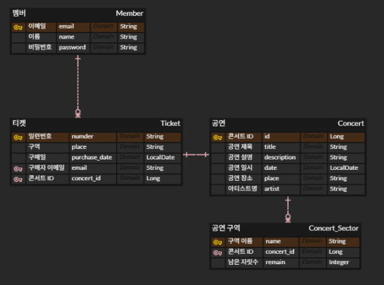
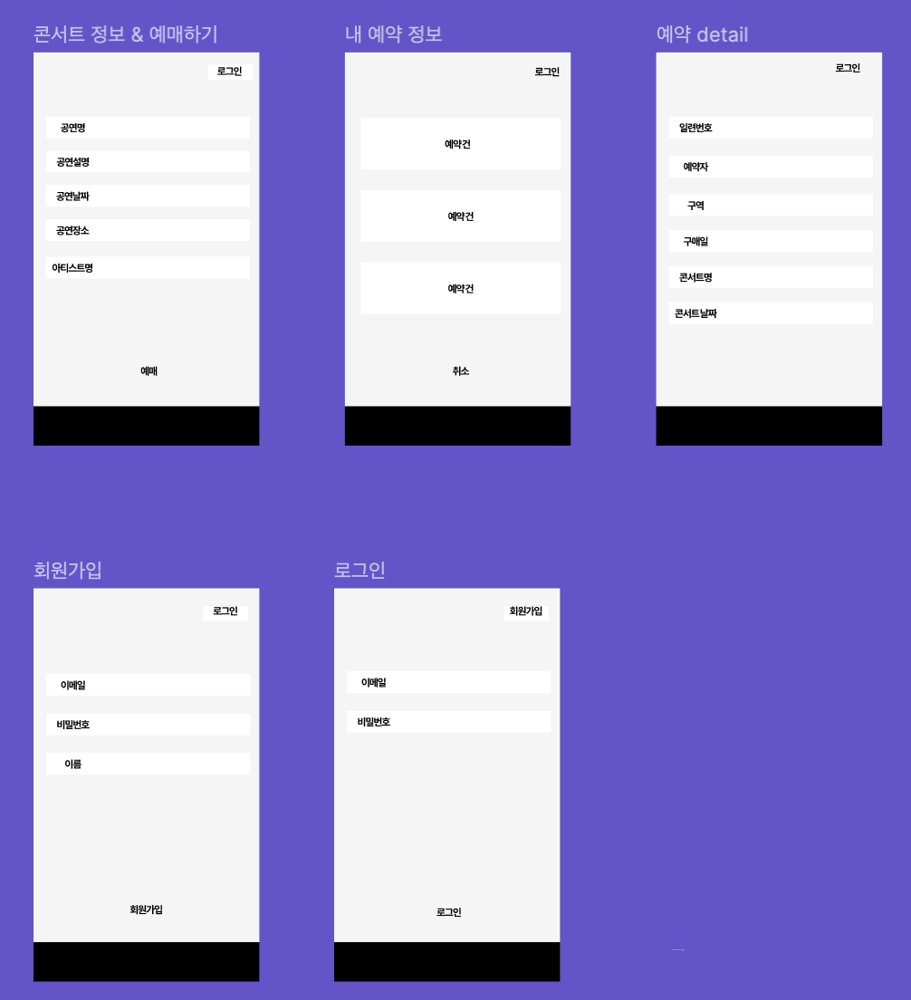

# 프로젝트명: Concert Ticketing System

## 프로젝트 소개
공연 티켓 예매 및 관리 시스템입니다. 사용자 로그인, 공연 조회, 예매, 취소, 관리자 공연 등록 기능 등을 제공합니다.  
JWT 기반 인증과 예외 처리를 통한 안정적인 API 환경을 구축하였습니다.

---

## 팀원 소개

| 이름 | 역할 | 주요 담당 기능 |
|------|------|----------------|
| 장군호 | 백엔드 |  공연 정보 조회 - 캐싱 기능 구현 |
| 김도연 | 백엔드 |  잔여 좌석 조회 - Redis 락을 이용한 남은 좌석 동시성 제어 포함 |
| 권용준 | 백엔드 | 회원가입, 로그인, JWT + 인증/인가 + 회원탈퇴 |
| 이의현 | 백엔드 | 티켓 CRUD(티켓팅, 티켓 조회, 티켓 삭제) |
| 한재현 | 백엔드 | 동시성 테스트 설계 및 실행 |

---

## 프로젝트 목적
- 공연 티켓 예매 시스템을 직접 구현하며 **RESTful API 설계**, **Spring Security**, **예외 처리**, **JWT 인증**, **JPA** 등의 기술을 실무처럼 경험
- **팀 프로젝트 협업** 과정에서의 Git 관리, 이슈 트래킹, 코드 리뷰 경험

---

## 기술 스택

| 구분 | 기술 |
|------|------|
| 언어 | Java 17 |
| 프레임워크 | Spring Boot 3.x |
| 빌드 도구 | Gradle |
| 데이터베이스 | MySQL, Redis |
| 보안 | Spring Security, JWT |
| ORM | Spring Data JPA |
| 배포 | Docker |
| 협업 도구 | GitHub, ERD, slack, Notion 등 |

---

## 개발 일정

| 단계 | 기간 | 내용 |
|------|------|------|
| 기획 및 설계 | 7/1 ~ 7/3 | 요구사항 정의, ERD 설계, API 문서 작성 |
| 개발 | 7/4 ~ 7/12 | 기능별 API 개발 및 통합 |
| 테스트 & 디버깅 | 7/13 ~ 7/14 | 전체 기능 점검, 리팩토링, 문서 정리 |

---

## API 명세서
> [API 작성](https://www.notion.so/teamsparta/2292dc3ef514809b852fd6de2acd9694?v=2292dc3ef51480a8b5b5000c3f2aecd0)

| 메서드 | URL | 설명 |
|--------|-----|------|
| POST | /api/signup | 회원가입 |
| POST | /api/login | 로그인 |
| GET | /api/concert | 공연 정보 조회 |
| GET | /api/seats | 남은 자리 조회 |
| POST | /api/tickets | 티켓 예매 |
| GET | /api/tickets/my | 예매 조회 |
| DELETE | /api/tickets/my | 예매 취소 |
| DELETE | /api/withdraw | 회원 탈퇴 |

---

## ERD
> 

---

## 와이어프레임
> 

---

## 문제 해결 및 트러블슈팅

> PPT 첨부

---

## 기타
- GitHub Repository: [팀장 GitHub](https://github.com/NewJKH/Ticketing)
- 협업 방식: GitHub Flow 전략 + PR 기반 코드 리뷰